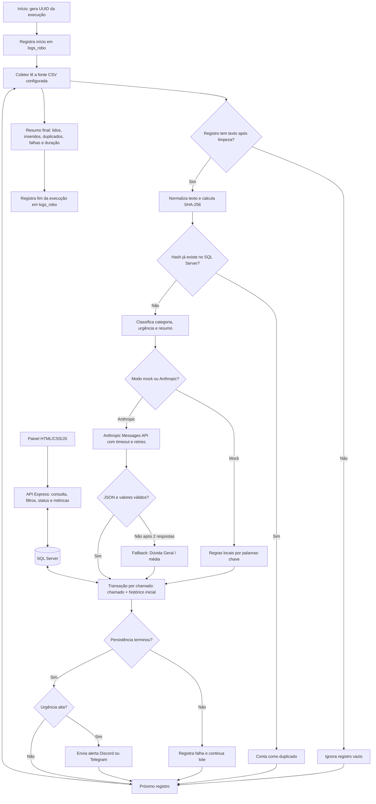

# Diagrama do fluxo

```mermaid
flowchart TD
    START["Início: gera UUID da execução"] --> LOGSTART["Registra início em logs_robo"]
    LOGSTART --> SOURCE["Coletor lê a fonte CSV configurada"]
    SOURCE --> CLEAN{"Registro tem texto após limpeza?"}
    CLEAN -- Não --> SKIP["Ignora registro vazio"]
    CLEAN -- Sim --> HASH["Normaliza texto e calcula SHA-256"]
    HASH --> EXISTS{"Hash já existe no SQL Server?"}
    EXISTS -- Sim --> DUP["Conta como duplicado"]
    EXISTS -- Não --> CLASSIFY["Classifica categoria, urgência e resumo"]
    CLASSIFY --> MODE{"Modo mock ou Anthropic?"}
    MODE -- Mock --> RULES["Regras locais por palavras-chave"]
    MODE -- Anthropic --> LLM["Anthropic Messages API com timeout e retries"]
    LLM --> VALID{"JSON e valores válidos?"}
    VALID -- Não após 2 respostas --> FALLBACK["Fallback: Dúvida Geral / média"]
    VALID -- Sim --> SAVE
    RULES --> SAVE["Transação por chamado: chamado + histórico inicial"]
    FALLBACK --> SAVE
    SAVE --> INSERTED{"Persistência terminou?"}
    INSERTED -- Não --> ERROR["Registra falha e continua lote"]
    INSERTED -- Sim --> URGENT{"Urgência alta?"}
    URGENT -- Sim --> ALERT["Envia alerta Discord ou Telegram"]
    URGENT -- Não --> NEXT["Próximo registro"]
    ALERT --> NEXT
    ERROR --> NEXT
    DUP --> NEXT
    SKIP --> NEXT
    NEXT --> SOURCE
    SOURCE --> SUMMARY["Resumo final: lidos, inseridos, duplicados, falhas e duração"]
    SUMMARY --> LOGEND["Registra fim da execução em logs_robo"]

    DB[("SQL Server")] <--> SAVE
    API["API Express: consulta, filtros, status e métricas"] <--> DB
    PANEL["Painel HTML/CSS/JS"] --> API
```

O Compose inicia SQL Server, espera o healthcheck, cria schema e seed com `db-init` e então inicia API e robô. O robô executa uma coleta e encerra por padrão.
